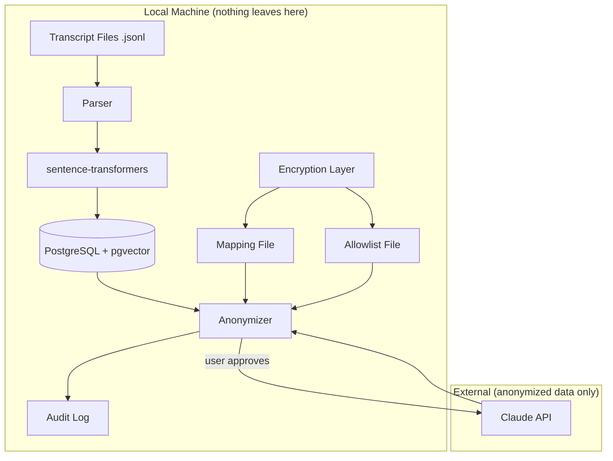
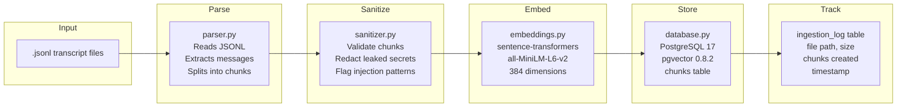
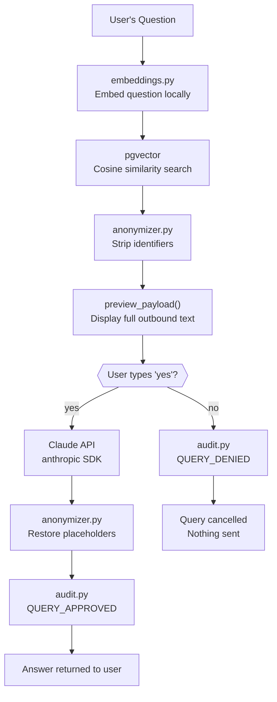
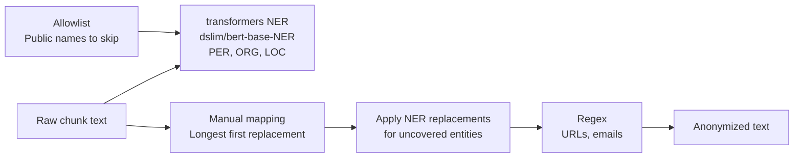
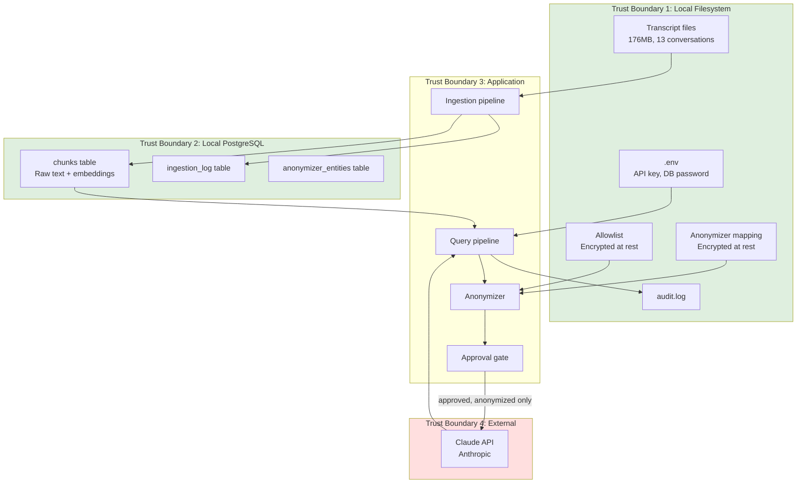
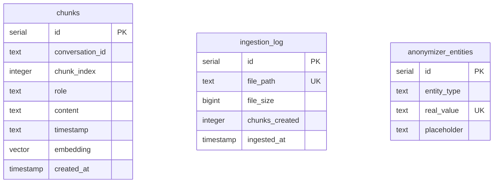

# Architecture

## System Overview

Memento is a local RAG pipeline with one external integration point: the Claude API. The system is divided into two pipelines (ingestion and query) with a clear privacy boundary between local processing and external communication.



## Ingestion Pipeline

The ingestion pipeline runs entirely on the local machine. No network calls are made.



### Components

**parser.py** reads Claude Code's `.jsonl` transcript format. Each line is a JSON object. Messages are nested inside a `message` field on entries with `type` set to "user" or "assistant". The parser extracts text content from message blocks, skipping tool use, thinking, and system entries. Long messages are split at sentence boundaries into chunks of 1000 characters or fewer.

**sanitizer.py** validates and sanitizes each chunk before storage. This is the memory poisoning defense. It rejects empty, oversized, or binary chunks. It redacts any leaked API keys or tokens (Anthropic, OpenAI, AWS, GitHub, Slack patterns). It flags text matching known prompt injection patterns (instruction overrides, role overrides, tag injection) with warnings but preserves the content, since conversations may legitimately discuss these topics.

**embeddings.py** loads the sentence-transformers model (all-MiniLM-L6-v2 by default) and generates 384-dimensional vectors for each chunk. The model runs locally on CPU. Batch encoding is used for efficiency during ingestion. The model is cached in memory after first load.

**database.py** manages the PostgreSQL connection and schema. Three tables:

| Table | Purpose |
|-------|---------|
| chunks | Stores chunk text, role, timestamp, conversation ID, and embedding vector |
| anonymizer_entities | Reserved for future entity tracking |
| ingestion_log | Tracks which files have been ingested to avoid reprocessing |

The chunks table has an IVFFlat index on the embedding column for fast cosine similarity search.

**ingest.py** orchestrates the pipeline. It compares transcript files against the ingestion log, processes only new files, and reports results.

## Query Pipeline

The query pipeline has both local and external components. The privacy boundary is enforced by the anonymization layer and the approval gate.



### Components

**query.py** orchestrates the full pipeline. It embeds the question locally, retrieves similar chunks from pgvector, anonymizes them, presents the payload for approval, calls the Claude API if approved, de-anonymizes the response, and logs the event.

**anonymizer.py** implements three layers of PII removal:



NER runs on the original text first so the model sees clean text without placeholder brackets. The manual mapping then replaces known identifiers with bracketed placeholders (e.g., `[USER]`, `[COMPANY_A]`), sorted by key length descending so "charlottesweb-app" is replaced before "charlotte". NER replacements are then applied for any entities that the manual mapping did not already cover. Finally, regex catches URLs and email addresses.

De-anonymization reverses the process using the same mapping, also sorted by placeholder length to prevent substring collisions.

**encryption.py** provides Fernet encryption for the mapping and allowlist files. Key derivation uses PBKDF2-HMAC-SHA256 with 600,000 iterations and a 16-byte random salt. The salt is prepended to the ciphertext so only one file is needed per encrypted source.

**audit.py** writes a JSONL log entry for every query attempt. The log records the action (approved or denied), timestamp, question character count, and number of chunks sent. It does not record the question text or any content.

## Data Flow and Trust Boundaries



### Trust boundary descriptions

**Boundary 1: Local Filesystem.** Contains the raw transcript data, encryption keys (via mapping file), and secrets. Protected by filesystem permissions and optional encryption at rest. This is the most sensitive boundary.

**Boundary 2: Local PostgreSQL.** Contains raw conversation chunks and embeddings. Protected by scram-sha-256 authentication. Accessible only from localhost.

**Boundary 3: Application.** The Python code that processes data. The anonymizer and approval gate enforce the policy that no identifiable data crosses to Boundary 4.

**Boundary 4: External.** The Claude API. Receives only anonymized text. Subject to Anthropic's data retention policy (7 day deletion, no training). This is the only boundary where data leaves the local machine.

## Database Schema



The chunks table has a composite unique constraint on (conversation_id, chunk_index) to prevent duplicate ingestion. The embedding column uses the vector type from pgvector with 384 dimensions matching the all-MiniLM-L6-v2 output. An IVFFlat index with 100 lists accelerates cosine similarity queries.

## File Layout

```
memento/
    .github/
        workflows/
            ci.yml                   Lint + test on every PR
            security-scan.yml        CodeQL, Bandit, pip-audit on every PR
            security-deep-scan.yml   Deep scan nightly at 04:17 UTC
        ISSUE_TEMPLATE/
            bug.md
            feature.md
            ticket.md
        dependabot.yml
        pull_request_template.md
        hooks/
            pre-commit-pii-check.sh  Reference copy of the git hook
    src/
        __init__.py
        config.py                    Environment loading, validation
        database.py                  PostgreSQL schema, connection management
        parser.py                    Transcript parsing, chunking
        embeddings.py                Local vector generation
        anonymizer.py                PII removal (mapping + NER + regex)
        sanitizer.py                 Chunk validation and secret redaction
        encryption.py                Fernet encryption for mapping files
        audit.py                     Query event logging
        query.py                     Full query pipeline orchestration
        ingest.py                    Full ingestion pipeline orchestration
    tests/
        __init__.py
        test_anonymizer.py           13 tests for PII leak detection
        test_sanitizer.py            14 tests for memory poisoning defense
    .env.example                     Configuration template
    .gitignore                       Blocks PII files from version control
    .pre-commit-config.yaml          8 pre-commit hooks
    pyproject.toml                   Build, lint, type check, test config
    requirements.txt                 Pinned production dependencies
    requirements-dev.txt             Dev and testing dependencies
    README.md                        Project overview and setup
    SECURITY.md                      Security controls reference
    ARCHITECTURE.md                  This file
```

## Future Components

**MCP Server.** An MCP (Model Context Protocol) server that allows Claude Code to query the Memento pipeline directly during a session, without the user running a separate command. This would make the memory retrieval automatic.

**Daemon.** A background process that periodically reads new transcripts, generates reflections and connections, and surfaces context at the start of new conversations. This is a separate service that uses the same database and embedding infrastructure.
