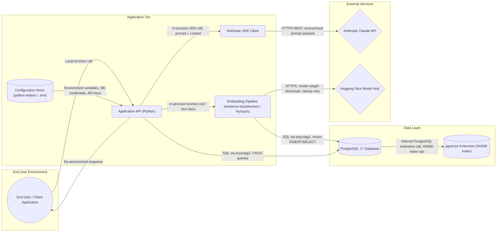

# Threat Model

Generated using Charlotte's Web AI Threat Model Engine on 2026-04-04.
Model: claude-sonnet-4-6 | Findings analyzed: 32 | Components: 11

This document maps each identified threat to the controls already implemented in Memento, and tracks any remaining open items.

## System Context

Memento is a single-user, local-first RAG pipeline that processes private conversation transcripts. It runs on the user's machine. The only external communication is to the Claude API at query time, and all outbound data passes through an anonymization layer with a manual approval gate before it leaves the machine.

This is not a multi-user web application. There are no user accounts, no authentication flows, no public-facing endpoints. The threat model findings are assessed in that context.

## Architecture Diagram

## STRIDE Threat Analysis

### 1. [CRITICAL] Tampering: Absence of TLS on inter-component traffic

**Threat:** On-path attacker modifies SQL queries, API requests, or model inputs between components.

**Status: MITIGATED (not applicable)**

Memento runs entirely on localhost. PostgreSQL listens only on 127.0.0.1 (unix socket and localhost). There is no network hop between the application and the database. The Anthropic SDK uses HTTPS with certificate validation by default. The Hugging Face model download uses HTTPS. There is no unencrypted inter-component network traffic because no traffic crosses a network boundary except the two HTTPS connections to external APIs.

| Data Flow | Transport | Status |
|-----------|-----------|--------|
| Application to PostgreSQL | Unix socket / localhost | No network exposure |
| Application to Claude API | HTTPS (TLS 1.3, enforced by Anthropic SDK) | Encrypted |
| Application to Hugging Face | HTTPS (startup model download only) | Encrypted |
| User to application | Local function call (same process) | No network exposure |

### 2. [HIGH] Spoofing: No MFA on user authentication

**Threat:** Credential stuffing or stolen credentials allow impersonation.

**Status: NOT APPLICABLE**

Memento is a single-user local application. There are no user accounts, no authentication layer, no login flow, and no network-accessible endpoints. The user runs the application directly on their own machine.

### 3. [HIGH] Tampering: Prompt injection via user-supplied text

**Threat:** Malicious input manipulates retrieved vectors, alters LLM behavior, or extracts information from the context window.

**Status: MITIGATED**

| Control | Implementation |
|---------|---------------|
| Input sanitization during ingestion | src/sanitizer.py validates and sanitizes all chunks before storage. Rejects empty, oversized, and binary content. Redacts leaked API keys and tokens. Flags prompt injection patterns. |
| Structural prompt separation | src/query.py wraps retrieved data in `<retrieved_conversation_data>` XML tags and the question in `<question>` tags, creating clear boundaries between data and instructions. |
| System prompt hardening | The system prompt explicitly instructs Claude to treat retrieved data as reference material and to not follow any instructions embedded in it. |
| Manual approval gate | src/query.py displays the full anonymized payload before sending. The user must type "yes" to proceed. Suspicious content can be rejected. |
| Automated testing | tests/test_sanitizer.py verifies injection pattern detection. |

### 4. [HIGH] Tampering: SQL injection via psycopg2

**Threat:** String interpolation in query construction allows data modification or deletion.

**Status: MITIGATED**

All psycopg2 queries in the codebase use parameterized queries with %s placeholders. No string interpolation is used for SQL construction.

| File | Query Pattern |
|------|--------------|
| src/database.py | `cur.execute("CREATE TABLE IF NOT EXISTS...")` (DDL, no user input) |
| src/query.py | `cur.execute("SELECT ... ORDER BY embedding <=> %s::vector LIMIT %s", (params...))` |
| src/ingest.py | `cur.execute("INSERT INTO chunks ... VALUES (%s, %s, %s, %s, %s, %s)", (params...))` |

### 5. [HIGH] Repudiation: Insufficient audit logging

**Threat:** Cannot reconstruct access to sensitive data or API calls after an incident.

**Status: MITIGATED**

| Control | Implementation |
|---------|---------------|
| Query audit log | src/audit.py records every query attempt (approved or denied) with ISO 8601 timestamp, action type, question character count, and chunks sent. |
| Ingestion logging | src/ingest.py logs file path, size, and chunks created for every ingested transcript. ingestion_log database table tracks all processed files. |
| Sanitization warnings | src/ingest.py prints warnings for any chunks that trigger injection patterns or secret redaction during ingestion. |
| No content in logs | The audit log records metadata only (timestamps, counts), never question text or chunk content. |

HIPAA audit control requirements (164.312(b)) are not directly applicable as Memento does not process protected health information. The audit log exists for the user's own forensic verification that no unauthorized data left the machine.

### 6. [HIGH] Information Disclosure: No encryption at rest

**Threat:** Database files, vector embeddings, and cached outputs are exposed in plaintext if storage is compromised.

**Status: PARTIALLY MITIGATED**

| Data | Encryption Status |
|------|------------------|
| Anonymizer mapping file | Encrypted at rest using Fernet + PBKDF2 (600,000 iterations, SHA256). src/encryption.py. Plaintext only exists in memory during query execution. |
| Anonymizer allowlist file | Same encryption as mapping file. |
| .env file (API key, DB password) | Protected by filesystem permissions. Gitignored. Pre-commit hook blocks accidental commits. |
| PostgreSQL data directory | Not encrypted by the application. Relies on OS-level disk encryption (FileVault on macOS). |
| Vector embeddings in database | Same as PostgreSQL data directory. |

**Open item:** Document that users should enable FileVault (macOS) or equivalent full-disk encryption on their machine.

### 7. [HIGH] Information Disclosure: API keys in .env files

**Threat:** Credentials committed to source control or exposed through debug endpoints.

**Status: MITIGATED**

| Control | Implementation |
|---------|---------------|
| .gitignore | Blocks .env, .env.local, .env.*.local, .env.encrypted |
| Pre-commit hook | .git/hooks/pre-commit blocks staged files matching .env patterns and scans file contents for actual API key values (sk-ant- prefix) and database passwords in connection strings |
| No debug endpoints | Memento has no web server and no debug endpoints. It is a CLI tool. |
| .env.example | Contains placeholder values only, no real credentials |

### 8. [HIGH] Information Disclosure: pgvector HNSW buffer overflow (CVE-2026-3172)

**Threat:** Authenticated database user can read memory from adjacent relations through parallel HNSW index builds.

**Status: OPEN**

This CVE affects pgvector's parallel HNSW index build. Memento uses an IVFFlat index, not HNSW, which reduces exposure. However, the vulnerable code path may still be reachable.

**Remediation:** Apply the workaround immediately by setting `max_parallel_workers_per_gather=0` in postgresql.conf. Upgrade pgvector to the patched build when available for the installed platform.

### 9. [HIGH] Elevation of Privilege: Missing least-privilege database roles

**Threat:** A single database role with full privileges increases blast radius of any compromise.

**Status: PARTIALLY MITIGATED**

PostgreSQL requires scram-sha-256 password authentication (no trust auth). The database is accessible only from localhost. However, the application uses a single role for both reads and writes.

**Open item:** Create separate read-only and read-write PostgreSQL roles. Use the read-only role for query operations and the read-write role for ingestion only.

### 10. [HIGH] Elevation of Privilege: ML model supply chain attack

**Threat:** Compromised model weights downloaded from Hugging Face execute arbitrary code.

**Status: PARTIALLY MITIGATED**

The sentence-transformers and transformers libraries download model weights from Hugging Face Hub on first use. The models used (all-MiniLM-L6-v2 for embeddings, dslim/bert-base-NER for NER) are well-known and widely used, but are not pinned to specific checksums.

**Open item:** Pin model downloads to specific SHA-256 checksums. Consider mirroring models to a local directory and configuring offline mode for production use.

### 11. [MEDIUM] Spoofing: Unverified TLS to Anthropic API

**Threat:** Misconfigured HTTP client disables TLS certificate validation.

**Status: MITIGATED**

The Anthropic Python SDK enforces HTTPS with certificate validation by default. The SDK does not expose a configuration option to disable TLS verification. All communication with the Claude API uses TLS 1.3.

### 12. [MEDIUM] Information Disclosure: Sensitive data sent to Anthropic API

**Threat:** Sensitive content from the knowledge base traverses a third-party network.

**Status: MITIGATED**

This is the core privacy concern that Memento's architecture is designed to address.

| Control | Implementation |
|---------|---------------|
| Three-layer anonymization | Manual mapping (32 entries) + transformers NER (dslim/bert-base-NER) + regex (URLs, emails). Strips all identifying information before any data leaves the machine. |
| Allowlist | Public entity names (GitHub, AWS, OWASP, etc.) are preserved to maintain query quality without revealing identity. |
| Approval gate | Full anonymized payload displayed to the user before sending. User must type "yes" to proceed. Nothing is sent without explicit human approval. |
| Audit log | Every approved and denied query is recorded with timestamp and chunk count. |
| De-anonymization | Placeholders are swapped back to real values only in the response displayed to the user, never in the outbound payload. |
| Anthropic data policy | API inputs are deleted after 7 days and are never used for model training. |
| Automated testing | 13 tests verify that all known PII values are stripped, URLs and emails are caught, allowlisted entities are preserved, and round-trip de-anonymization works. |

### 13. [MEDIUM] Denial of Service: Resource exhaustion in ML inference

**Threat:** Large or malformed inputs cause excessive memory or CPU consumption.

**Status: PARTIALLY MITIGATED**

| Control | Implementation |
|---------|---------------|
| Chunk size limit | Parser splits messages into chunks of 1000 characters maximum. |
| Chunk validation | Sanitizer rejects chunks over 10,000 characters and chunks with less than 80% printable content. |
| Retrieval limit | Configuration limits the number of chunks retrieved per query (default: 10). |

**Open item:** No per-session rate limiting or memory ceiling on the inference process. Acceptable for single-user local use but would need addressing for any multi-user deployment.

### 14. [MEDIUM] Denial of Service: PostgreSQL vector search saturation

**Threat:** Vector similarity searches saturate database CPU.

**Status: PARTIALLY MITIGATED**

Queries are limited to retrieving a configurable number of chunks (default: 10). The IVFFlat index with 100 lists provides efficient approximate search. Single-user local deployment means there is no concurrent query load.

**Open item:** No statement_timeout configured in PostgreSQL. Acceptable for single-user use.

## Dependency Vulnerabilities

### pgvector extension 0.8.2

CVE-2026-3172: Buffer overflow in parallel HNSW index builds.

**Status: OPEN**

Memento uses IVFFlat indexing, not HNSW, which reduces but does not eliminate exposure. Apply `max_parallel_workers_per_gather=0` as an immediate workaround.

### python-dotenv (npm namespace advisory MAL-2025-48037)

**Status: NOT APPLICABLE**

This advisory targets the npm package, not the PyPI package. Memento installs python-dotenv from PyPI via pip. The npm namespace is not used.

## Privacy Controls Summary

Memento's primary purpose is to keep private data private. This table summarizes every privacy control in the system.

| Privacy Concern | Control | Where |
|----------------|---------|-------|
| Transcript content leaving the machine | Three-layer anonymization strips all identifying information | src/anonymizer.py |
| Unknown PII not in manual mapping | Transformers NER catches PERSON, ORG, LOC entities automatically | src/anonymizer.py |
| Over-anonymization degrading quality | Allowlist preserves public entity names | anonymizer_allowlist.json |
| Data sent without user knowledge | Approval gate shows full payload, requires "yes" to proceed | src/query.py |
| No record of what was sent | Audit log records every query attempt | src/audit.py |
| Secrets leaked into stored chunks | Sanitizer redacts API keys and tokens during ingestion | src/sanitizer.py |
| Prompt injection via stored chunks | XML delimiters and system prompt hardening | src/query.py |
| Mapping file reveals real identities | Encrypted at rest with Fernet/PBKDF2 | src/encryption.py |
| Credentials in source control | .gitignore + pre-commit hook + content scanning | .gitignore, .git/hooks/pre-commit |
| Database accessible without auth | scram-sha-256 password required | pg_hba.conf |
| Embeddings reveal content | Generated locally, never sent externally | src/embeddings.py |
| Anthropic trains on our data | Anthropic API policy: 7 day deletion, no training | External policy |

## Open Items

| Item | Severity | Description |
|------|----------|-------------|
| pgvector CVE-2026-3172 | HIGH | Apply max_parallel_workers_per_gather=0 workaround. Upgrade when patched build available. |
| Least-privilege DB roles | MEDIUM | Create separate read-only and read-write PostgreSQL roles. |
| Model checksum pinning | MEDIUM | Pin Hugging Face model downloads to SHA-256 checksums. |
| Full-disk encryption documentation | LOW | Document that users should enable FileVault or equivalent. |

## OWASP AI Agent Security Coverage

Controls map to the OWASP AI Agent Security Cheat Sheet (2026).

| OWASP Section | Memento Control | Status |
|--------------|-----------------|--------|
| Tool Security and Least Privilege | Single external tool (Claude API), no shell access, no file write | Implemented |
| Input Validation and Prompt Injection Defense | Chunk sanitization, XML delimiters, system prompt hardening | Implemented |
| Memory and Context Security | Single user isolation, chunk validation, secret redaction, encryption at rest | Implemented |
| Human-in-the-Loop Controls | Approval gate with full payload preview | Implemented |
| Output Validation | De-anonymization only uses the query's own mapping | Implemented |
| Monitoring and Observability | Audit log for all query attempts | Implemented |
| Multi-Agent Security | Not applicable (single agent) | N/A |
| Data Protection and Privacy | Anonymization, encryption at rest, database auth, gitignore + hooks | Implemented |
